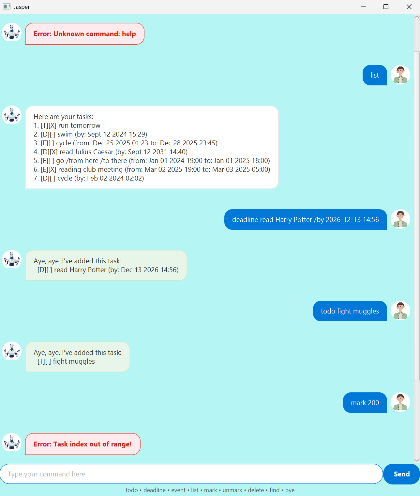

# Jasper User Guide


Jasper is a desktop application for storing and managing tasks, providing both a GUI and CLI interface for efficient usage.



---

## Quick start
1. Ensure that Java 25 or later is installed on your computer.  
  **Mac users**: Ensure that you have the JDK version prescribed [here](https://se-education.org/guides/tutorials/javaInstallationMac.html).
2. Download the latest `.jar` file from [here](https://github.com/cacklycrackle/ip/releases/latest).
3. Copy the file to the folder that you want to use as the *home folder* for Jasper.  
  Relative to this folder, tasks will be saved locally at `./data/jasper.txt`.
4. Open a terminal, `cd` to the folder containing the JAR file and run `java -jar Jasper.jar` to load the GUI.  
  **Note**: While the CLI interface can be loaded with `java -cp Jasper.jar jasper.CliMain`, this is **not** guaranteed to carry over to future releases.
5. Type a command in the command box and press `Enter` or the send button to execute it.  
  Refer to the [Features](#features) section for details of each available command.
6. Type `bye` to exit the program.

---

## Features

### Command format

The following conventions are used in the command formats below:

* Words surrounded by angle brackets `<>` are parameters supplied by the user. For example, replace `<description>` in `todo <description>` with a name value such as `run`.
* No command can contain the pipe character `|`.
* Acceptable datetime format(s) for all commands where needed: 
  * `uuuu-MM-dd HH:mm` (e.g. `2025-12-04 13:40` for 4th Dec 2025, 1:40 p.m.)
* The index of entries in the list can be identified by running the `list` command.
  * By default, valid indices are positive integers that do not exceed the task list size.
* Parameters can *only* be entered in the order shown.
* Extra parameters for commands that take no parameters **will** produce an error.

### Exiting the program: `bye`

Exits the program after a short pause.

**Format**: `bye`

### List current tasks: `list`

Lists all tasks currently present.

**Format**: `list`

**Example**: If list is empty, output is `No tasks here! Add some to track.`.

### Add a todo task: `todo <description>`

Adds a simple undone task with a description.

**Format**: `todo <description>`

**Example:** `todo run` adds a task with a description `run`.

**Expected output**:
```text
Aye, aye. I've added this task:
  [T][ ] run
```

### Add a task with a deadline: `deadline <description> /by <datetime>`

Adds an undone task with a description and deadline.

**Format**: `deadline <description> /by <datetime>`

**Example:** `deadline write essay /by 2024-03-02 08:20` adds a task with description `write essay` and intended deadline of 2nd March 2024, 8:20 a.m. 

**Expected output**:
```text
Aye, aye. I've added this task:
  [D][ ] (by: Mar 02 2024 08:20)
```

### Add an event with start and end: `event <description> /from <datetime> /to <datetime>`

Adds an undone event with start and end datetimes.

**Format**: `event <description> /from <datetime> /to <datetime>`

**Example:** `event party /from 2027-04-12 07:20 /to 2027-04-12 17:30` adds an event with description `party` that lasts from 12th April 2027, 7:20 a.m. until 12th April 2027, 5:30 p.m.

**Expected output**:
```text
Aye, aye. I've added this task:
  [E][ ]  party (from: Apr 12 2027 07:20 to: Apr 12 2027 17:30)
```

### Delete entries: `delete <index>` or `delete <start-index>..<stop-index>`

Deletes the entry at index `<index>` / entries between indices `<start-index>` and `<stop-index>` (both inclusive).

**Format**: `delete <index>` or `delete <start-index>..<stop-index>`
* For range format, first index `<start-index>` cannot exceed second index `<stop-index>`.
  * With `<start-index>` = `<stop-index>`, it is equivalent to running `delete <start-index>`.

**Examples:**
* `delete 3` deletes the 3rd entry in the list. 
* `delete 10..15` deletes 10th to 15th entries (i.e. 6 entries). 

### Mark entries as done: `mark <index>` or `mark <start-index>..<stop-index>`

Marks the entry at index `<index>` / entries between indices `<start-index>` and `<stop-index>` (both inclusive) as completed.

**Format**: `mark <index>` or `mark <start-index>..<stop-index>`
* For range format, first index `<start-index>` cannot exceed second index `<stop-index>`.
  * With `<start-index>` = `<stop-index>`, it is equivalent to running `mark <start-index>`.

**Examples:**
  * `mark 3` marks the 3rd entry in the list as done. 
    * Supposing 3rd entry is from running `todo run`, **expected output**:
      ```text
      Alright, I've marked these tasks as done:
        3. [T][X] run
      ```
  * `mark 10..15` marks all 6 entries from 10th to 15th as done. 

### Unmark tasks to be not done: `unmark <index>` or `unmark <start-index>..<stop-index>`

Unmarks the entry at index `<index>` / entries between indices `<start-index>` and `<stop-index>` (both inclusive) as not completed.

**Format**: `unmark <index>` or `unmark <start-index>..<stop-index>`
* For range format, first index `<start-index>` cannot exceed second index `<stop-index>`.
  * With `<start-index>` = `<stop-index>`, it is equivalent to running `mark <start-index>`.

**Examples:**
* `unmark 3` unmarks the 3rd entry in the list. 
  * Supposing 3rd entry is from running `todo run`, **expected output**:
    ```text
    Get to work... I've marked these tasks as not done yet:
      3. [T][ ] run
    ```
* `unmark 10..15` unmarks all 6 entries from 10th to 15th,

### Find a task based on partial match of description: `find <text>`

Finds all tasks where `<text>` is contained in the task's description.

**Format**: `find <text>`

**Examples:**
* If task list is empty, output is `No tasks here! Add some to search through.`.
* If there are no matching tasks, output is `Where might the matching tasks be?`.
* Suppose the only tasks containing "run" in their description are the 3rd task `todo run` and 7th task `deadline practice running barefoot /by 2026-12-01 01:23`. Expected output of `find run`:
  ```text
  Matching tasks, here you go:
  3. [T][ ] run
  7. [D][ ] practice running barefoot (by: 1 Dec 2026 01:23)
  ```

### Saving data

Jasper automatically saves data after every command that modifies the task list. You do not need to save manually.

---

## Command Summary

| **Action**       | **Format**                                                  |
|:-----------------|:------------------------------------------------------------|
| **Add todo**     | `todo <description>`                                        | 
| **Add deadline** | `deadline <description> /by <datetime>`                     |
| **Add event**    | `event <description> /from <datetime> /to <datetime>`       |
| **Delete**       | `delete <index>` <br/> `delete <start-index>..<stop-index>` | 
| **Exit**         | `bye`                                                       |
| **Find**         | `find <text>`                                               |
| **Mark**         | `mark <index>` <br/> `mark <start-index>..<stop-index>`     |
| **List**         | `list`                                                      |
| **Unmark**       | `unmark <index>` <br/> `unmark <start-index>..<stop-index>` |
